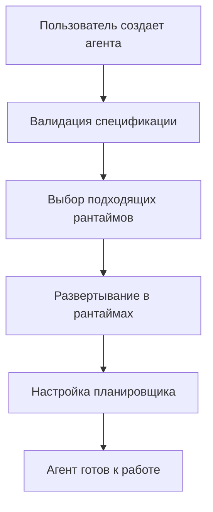
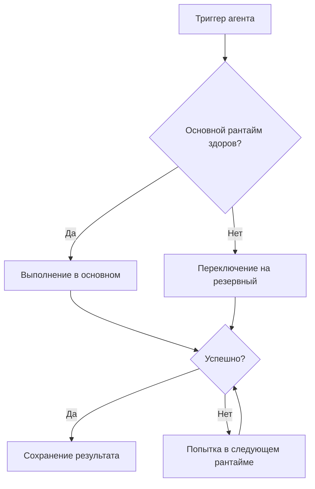

# 🏗️ Колыбель v2 - Независимая архитектура агентов

## 🎯 Обзор новой архитектуры

Колыбель v2 реализует принципы **независимой архитектуры агентов**, которая обеспечивает:

- ✅ **Абстракцию от конкретного рантайма** - агенты описываются в нейтральном формате
- ✅ **Автоматический failover** - переключение между рантаймами при сбоях
- ✅ **Масштабируемость** - поддержка множества платформ выполнения
- ✅ **Версионирование** - спецификации агентов хранятся в Git/DB
- ✅ **Портабельность** - один агент может работать в разных средах

## 🏛️ Архитектурные компоненты

### 1. **Agent Specification** (Нейтральная схема)

```python
# Пример спецификации агента в нейтральном формате
{
  "id": "rss-monitor-001",
  "name": "DTF RSS Monitor",
  "owner": "kolybel_user",
  "triggers": [
    {
      "type": "schedule",
      "config": {"cron": "0 9,15,20 * * *"}
    }
  ],
  "steps": [
    {
      "id": "fetch_rss",
      "type": "parse_rss",
      "config": {"url": "https://dtf.ru/rss"}
    },
    {
      "id": "generate_content",
      "type": "generate_content",
      "config": {"model": "mistral"}
    },
    {
      "id": "send_telegram",
      "type": "send_message",
      "config": {"platform": "telegram"}
    }
  ],
  "runtime_preferences": ["n8n", "local", "docker"]
}
```

### 2. **Execution Adapters** (Плагинная система)

#### LocalRuntimeAdapter

- Выполняет агентов локально на сервере Колыбели
- Поддерживает все базовые типы шагов
- Всегда доступен как fallback

#### N8NRuntimeAdapter

- Конвертирует спецификации в n8n workflows
- Использует n8n API для развертывания и выполнения
- Автоматически недоступен при сбоях n8n

#### DockerRuntimeAdapter

- Упаковывает агентов в Docker контейнеры
- Обеспечивает изоляцию и масштабируемость
- Поддерживает Kubernetes для оркестрации

### 3. **Runtime Orchestrator** (Оркестратор выполнения)

Центральный компонент, который:

- **Выбирает рантайм** на основе предпочтений и доступности
- **Управляет политиками** выполнения (failover, load balancing)
- **Мониторит здоровье** всех рантаймов
- **Ведет статистику** выполнения агентов

#### Политики выполнения:

- `PRIMARY_ONLY` - только основной рантайм
- `FAILOVER` - переключение при сбое (по умолчанию)
- `LOAD_BALANCE` - балансировка нагрузки
- `REDUNDANT` - дублирование выполнения

### 4. **Agent Manager** (Менеджер агентов)

Высокоуровневый API для:

- Создания агентов из шаблонов
- Управления жизненным циклом
- Импорта/экспорта спецификаций
- Миграции из старых форматов

## 🔄 Принципы работы

### Создание агента



### Выполнение с Failover



## 🛠️ Типы шагов агентов

### Базовые шаги:

- `HTTP_REQUEST` - HTTP запросы
- `PARSE_RSS` - Парсинг RSS лент
- `GENERATE_CONTENT` - Генерация контента через LLM
- `SEND_MESSAGE` - Отправка сообщений (Telegram, etc.)
- `TRANSFORM_DATA` - Трансформация данных
- `FILTER_DATA` - Фильтрация данных
- `CONDITIONAL` - Условная логика
- `LOOP` - Циклы
- `DELAY` - Задержки
- `CUSTOM_CODE` - Пользовательский код

### Типы триггеров:

- `SCHEDULE` - По расписанию (cron)
- `HTTP_WEBHOOK` - HTTP webhook
- `RSS_FEED` - Изменения в RSS
- `FILE_WATCH` - Изменения файлов
- `MESSAGE_QUEUE` - Сообщения из очереди
- `MANUAL` - Ручной запуск

## 📁 Структура файлов

```
kolybel_core/
├── agent_specification.py      # Нейтральный формат спецификаций
├── runtime_adapters.py         # Адаптеры для рантаймов
├── runtime_orchestrator.py     # Оркестратор выполнения
├── agents_v2.py               # Новая система агентов
├── main_v2.py                 # Обновленная точка входа
├── web_interface.py           # Веб-интерфейс (обновлен)
├── deployed_agents/           # Развернутые агенты
├── runtime_deployments.json   # Реестр развертываний
└── agent_logs/               # Логи выполнения
```

## 🚀 Быстрый старт

### 1. Установка зависимостей

```bash
pip install -r requirements.txt
```

### 2. Запуск консольного интерфейса

```bash
python main_v2.py
```

### 3. Запуск веб-интерфейса

```bash
python start_web_interface.py
```

## 🔧 Конфигурация рантаймов

### Настройка n8n

```bash
export N8N_API_URL="http://localhost:5678/api/v1"
export N8N_USER="admin"
export N8N_PASSWORD="password"
```

### Настройка Docker

```bash
# Docker должен быть установлен и запущен
docker --version
```

### Конфигурация в коде

```python
config = {
    'execution_policy': 'failover',
    'health_check_interval': 60,
    'n8n': {
        'api_url': 'http://localhost:5678/api/v1',
        'username': 'admin',
        'password': 'password'
    },
    'docker': {
        'enabled': True
    },
    'local': {
        'max_concurrent': 5
    }
}

manager = AgentManager(config=config)
```